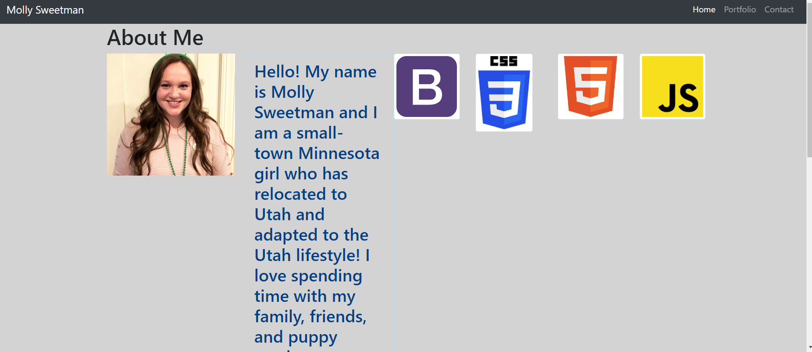

# mollysweetman.github.io

Showing the use of Bootstrap grids, columns and rows. 
utilizing three html pages: 
    1. index.html
    2. portfolio.html
    3. contact.html
one style sheet:
    1. style.css
one Assets folder

This website is designed to show a portfolio.This is a simplified, functional example of a personal website. This particular example demonstrates a personal portfolio, with crisp-quality photo displays,a memorable introduction to the page, and links to social medias. The website can be used as a company/ personal homepage but also allows you to connect the end-users viewing your page to other ways to follow and interact with you on different mediums (Twitter, Facebook, Instagram, etc.). This format is a cost-effective but personalized option for a simple company website or an individual portfolio. This website can be used as a base and be customized to many purposes to fit your desired use and user experience. This portfolio can be viewed from multiple web browsers on a laptop computer, a desktop monitor, or a mobile phone to allow all of your contacts, regardless of their personal preference of connectivity, to stay connected with you. 

[mollysweetman](https://github.com/mollysweetman/mollysweetman.github.io) is hosted on github pages

this application is authored by Molly Sweetman https://github.com/mollysweetman

Credits
    google- background image on the portfolio page. 